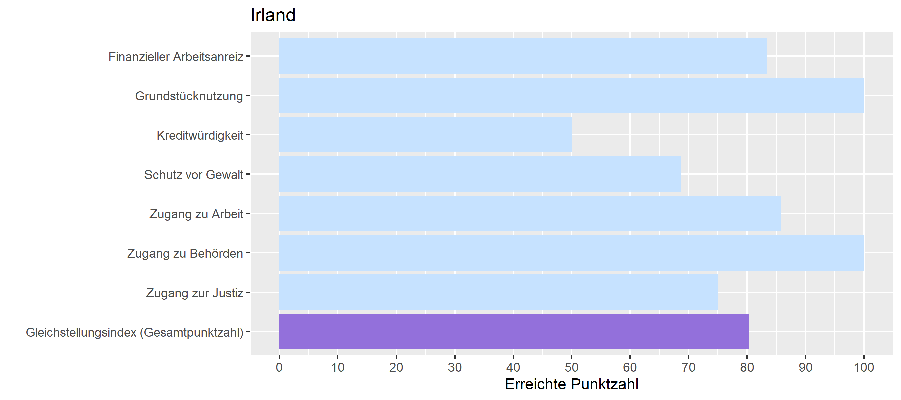

```{r setup, include=FALSE}
knitr::opts_chunk$set(echo = FALSE)

library(usethis)
library(dplyr)
library(tidyverse)
library(ggplot2)
library(scales)
library("openxlsx")
library(knitr)
library(ggforce)

bechdel <- readr::read_csv('https://raw.githubusercontent.com/rfordatascience/tidytuesday/master/data/2021/2021-03-09/movies.csv')
# Trennung bei Länder-Kombinationen und Entfernung NAs
bechdel %>%
  separate_rows(country, sep = ", ") %>%
  group_by(country) %>%
  drop_na(country) -> bechdel2

equality <- read.xlsx(xlsxFile = "data/Equality_Index.xlsx", 
                      sheet = 2)
```

# Ergebnisse beim Gleichstellungsindex
```{r, layout='1-page'}
equality_long <- equality %>%
  filter(Economy == "Ireland") %>%
  select(ends_with("score"))

# Umbenennung der Skalen
names(equality_long) <- c("Gleichstellungsindex (Gesamtpunktzahl)", "Zugang zu Behörden", "Grundstücknutzung", "Zugang zur Justiz", "Finanzieller Arbeitsanreiz", "Kreditwürdigkeit", "Zugang zu Arbeit", "Schutz vor Gewalt")
  
pivot_longer(equality_long,
            cols = everything(),
            names_to = "name", values_to = "score") -> equality_long
equality_long %>% mutate(ToHighlight = ifelse(name == "Gleichstellungsindex (Gesamtpunktzahl)", "ja", "nein")) -> equality_long

library(forcats)

p <- equality_long %>%
  ggplot() +
    aes(y = fct_relevel(name, "Gleichstellungsindex (Gesamtpunktzahl)", 
                        "Zugang zur Justiz", "Zugang zu Behörden", 
                        "Zugang zu Arbeit", "Schutz vor Gewalt", 
                        "Kreditwürdigkeit", "Grundstücknutzung", 
                        "Finanzieller Arbeitsanreiz"), 
        x = score, 
        xmin = 0, xmax = 100,
        fill = ToHighlight) +
    geom_col() +
    labs(title = "Irland", x = "Erreichte Punktzahl", y = "") +
    scale_x_continuous(breaks = c(0, 10, 20, 30, 40, 50, 60, 70, 80, 90, 100)) +
    scale_fill_manual(values = c("ja" = "#9370db", "nein" = "slategray1"), guide = "none")

ggsave("images/Irland_equality.png", plot = p, height = 4, width = 9)
```




### Hindernisse 


```{r panelset, layout='l-body-outset', echo=FALSE}
xaringanExtra::use_panelset()
```

:::l-body-outset

::::: {.panelset}

::: {.panel}

#### Finanzieller Arbeitsanreiz {.panel-name}

Leistungen für die Betreuung von Kindern ist nicht steuerlich absetzbar.
:::

::: {.panel}

#### Grundstücknutzung {.panel-name}

Nach dem Gleichstellungsindex vom CFR hat Irland keine Hindernisse in diesem Bereich.
:::

::: {.panel}

#### Kreditwürdigkeit {.panel-name}
Einzelhändler geben keine Informationen an private Kreditbüros oder öffentliche Kreditregister weiter, was Frauen daran hindert, ihre Kredithistorie aufzubauen, um Zugang zu Finanzmitteln zu erhalten.

Versorgungsunternehmen stellen keine Informationen für private Kreditbüros oder öffentliche Kreditregister zur Verfügung, was Frauen daran hindert, sich eine Kredithistorie aufzubauen, um Zugang zu Finanzmitteln zu erhalte
:::

::: {.panel}

#### Schutz vor Gewalt {.panel-name}
Es existiert kein Gesetz, das Vergewaltigung in der Ehe verbietet.

Es gibt keine klaren strafrechtlichen Folgen für häusliche Gewalt.

Mit Zustimmung der Eltern oder richterlicher Genehmigung liegt das Mindestheiratsalter für Mädchen unter 18 Jahren.
:::

::: {.panel}

#### Zugang zu Arbeit {.panel-name}
Frauen erhalten weniger als zwei Drittel ihres Lohns für die ersten vierzehn Wochen ihres Urlaubs bzw. für die Dauer des Urlaubs, wenn dieser kürzer ist.

Es existiert keine gesetzlich geregelte, bezahlte Elternzeit.

Eltern können nicht flexibel arbeiten.

Irland hat einen zehntägigen bezahlten Vaterschaftsurlaub eingeführt.
:::

::: {.panel}

#### Zugang zu Behörden {.panel-name}

Nach dem Gleichstellungsindex vom CFR hat Irland keine Hindernisse in diesem Bereich.
:::

::: {.panel}

#### Zugang zur Justiz {.panel-name}
Das Gesetz sieht keine Antidiskriminierungskommission vor.
:::

:::::

:::


## Ergebnisse beim Bechdel-Test
Fast 60 % der Filme, die in Irland produziert sind, bestehen den Test nicht =  hauptsächlich, weil die weiblichen Rollen nicht miteinander reden. Ein weiterer am häufigsten vertretener Grund ist, dass es weiner als zwei Frauen im Film gibt.
```{r}
# Kreisdiagramm oder ridgeline Plot für die Bewertungskriterien
mutate(bechdel2, criteria = recode(clean_test, 
                          men = "Frauen reden nur über Männer", 
                          notalk = "Frauen reden nicht miteinander", 
                          nowomen = "Es gibt weniger als 2 Frauen", 
                          ok = "Film besteht alle Kriterien",
                          dubious = "Bewertung ist unsicher")) -> bechdel2

# Sortierung der Ergebnisse
bechdel2$criteria <- ordered(bechdel2$criteria, levels = c("Es gibt weniger als 2 Frauen",
                                                           "Frauen reden nicht miteinander",
                                                           "Frauen reden nur über Männer",
                                                           "Film besteht alle Kriterien",
                                                           "Bewertung ist unsicher"))

bechdel2 %>%
  filter(country == "Ireland") %>% 
  count(criteria) -> data_kreis

ggplot(data_kreis, aes(x="", y=desc(n), fill=criteria)) +
      geom_bar(stat="identity", width=1) +
      coord_polar("y", start=0) +
      theme_minimal()+
      geom_text(aes(label = paste0(n)), position = position_stack(vjust = 0.5)) +
      scale_y_continuous(breaks = 0:14) +
      labs(x = NULL, y = NULL, fill = NULL,
           caption = "Ergebnisse des Bechdel-Tests: Anzahl der Filme") +
  theme(
        axis.title = element_blank(), 
        axis.ticks = element_blank(), 
        axis.text = element_blank(),
        panel.background = element_blank(),
        panel.border=element_blank(),
        plot.background = element_blank(), 
        panel.grid.major = element_blank(),
        panel.grid.minor = element_blank(),
        legend.background = element_rect(fill = "white"),
        plot.caption = element_text(size = 12, hjust = 0.5))
```

Am meisten wird in Irland Romance produziert. In dem Genre bestehen drei von vier Filmen den Bechdel-Test. Thriller und Action fallen jedoch komplett durch. Adventure-Filme fallen zum Großteil durch. 
```{r}
# Vergleich der bestandenen/durchgefallenen Filme pro Genre
bechdel2 %>%
  separate_rows(genre, sep = ", ") %>%
  drop_na(genre) %>%
  filter(country == "Ireland") %>%
  group_by(binary) %>%
  count(genre) -> bechdel_genre

mutate(bechdel_genre, Ergebnis = recode(binary, FAIL = "durchgefallen",
                                        PASS = "bestanden")) -> bechdel_genre

bechdel_genre %>%
  ggplot(aes(x = n, y = reorder(genre, n), fill=Ergebnis))+
    geom_col(position="dodge")+
    theme_minimal()+
    scale_x_continuous() +
    labs(x = "Anzahl der Filme", y = NULL, fill = NULL, caption = "Ergebnisse des Bechdel-Tests nach Genre") +
    scale_fill_manual(values = c(durchgefallen = "pink", bestanden = "lightblue")) +
    theme(
          axis.text=element_text(size=10),    
          panel.border=element_blank(),
          plot.background = element_blank(), 
          legend.background = element_rect(fill = "white"),
          plot.caption = element_text(size = 12, hjust = 0.5, vjust = -1))


```
## Fazit
Bezüglich der Gleichstellung steht Irland gut da, aber dies hat keinen Einfluss auf die dort produzierten Filme. Mehr als die Hälfte fallen beim Bechdel-Test durch, vor allem da Frauen nicht miteinander sprechen. Thriller-, Action- und Adventure-Filme bestehen den Test am meisten nicht. Romance hingegen besteht den Test am meisten. 
