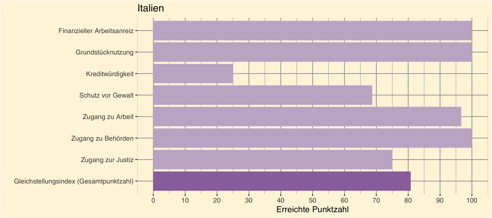

```{r setup, include=FALSE}
knitr::opts_chunk$set(echo = FALSE)

library(usethis)
library(dplyr)
library(tidyverse)
library(ggplot2)
library(scales)
library("openxlsx")
library(knitr)
library(ggforce)
library(extrafont)
#loadfonts(device = "win")

bechdel <- readr::read_csv('https://raw.githubusercontent.com/rfordatascience/tidytuesday/master/data/2021/2021-03-09/movies.csv')
# Trennung bei Länder-Kombinationen und Entfernung NAs
bechdel %>%
  separate_rows(country, sep = ", ") %>%
  group_by(country) %>%
  drop_na(country) -> bechdel2

equality <- read.xlsx(xlsxFile = "data/Equality_Index.xlsx", 
                      sheet = 2)
```

# Ergebnisse beim Gleichstellungsindex
```{r, layout='1-page'}
equality_long <- equality %>%
  filter(Economy == "Italy") %>%
  select(ends_with("score"))

# Umbenennung der Skalen
names(equality_long) <- c("Gleichstellungsindex (Gesamtpunktzahl)", "Zugang zu Behörden", "Grundstücknutzung", "Zugang zur Justiz", "Finanzieller Arbeitsanreiz", "Kreditwürdigkeit", "Zugang zu Arbeit", "Schutz vor Gewalt")
  
pivot_longer(equality_long,
            cols = everything(),
            names_to = "name", values_to = "score") -> equality_long
equality_long %>% mutate(ToHighlight = ifelse(name == "Gleichstellungsindex (Gesamtpunktzahl)", "ja", "nein")) -> equality_long

library(forcats)

p <- equality_long %>%
  ggplot() +
    aes(y = fct_relevel(name, "Gleichstellungsindex (Gesamtpunktzahl)", 
                        "Zugang zur Justiz", "Zugang zu Behörden", 
                        "Zugang zu Arbeit", "Schutz vor Gewalt", 
                        "Kreditwürdigkeit", "Grundstücknutzung", 
                        "Finanzieller Arbeitsanreiz"), 
        x = score, 
        xmin = 0, xmax = 100,
        fill = ToHighlight) +
    geom_col() +
    labs(title = "Italien", x = "Erreichte Punktzahl", y = "") +
    scale_x_continuous(breaks = c(0, 10, 20, 30, 40, 50, 60, 70, 80, 90, 100)) +
    scale_fill_manual(values = c("ja" = "#9B72AA", "nein" = "#C6B4CE"), guide = "none") +
    theme(plot.background = element_rect(fill = "#FFF5DE"), 
          panel.background = element_rect(fill = "#FFF5DE"),
          panel.grid = element_line(colour = "darkgray"),
          text=element_text(family = "sans")) 

ggsave("images/Italy_equality.png", plot = p, height = 4, width = 9)
```




### Hindernisse 


```{r panelset, layout='l-body-outset', echo=FALSE}
# Erstellung eines Panelsets
xaringanExtra::use_panelset()

xaringanExtra::style_panelset_tabs(
  active_foreground = "#9B72AA",
  hover_foreground = "black",
  inactive_opacity = 0.5
)
```

:::l-body-outset

::::: {.panelset}

::: {.panel}

#### Finanzieller Arbeitsanreiz {.panel-name}

Nach dem Gleichstellungsindex vom CFR hat Italien keine Hindernisse in diesem Bereich.
:::

::: {.panel}

#### Grundstücknutzung {.panel-name}

Nach dem Gleichstellungsindex vom CFR hat Italien keine Hindernisse in diesem Bereich.
:::

::: {.panel}

#### Kreditwürdigkeit {.panel-name}
Einzelhändler geben keine Informationen an private Kreditbüros oder öffentliche Kreditregister weiter, was Frauen daran hindert, ihre Kredithistorie aufzubauen, um Zugang zu Finanzmitteln zu erhalten.

Versorgungsunternehmen stellen keine Informationen für private Kreditbüros oder öffentliche Kreditregister zur Verfügung, was Frauen daran hindert, sich eine Kredithistorie aufzubauen, um Zugang zu Finanzmitteln zu erhalten.
:::

::: {.panel}

#### Schutz vor Gewalt {.panel-name}
Es existiert kein Gesetz, das sexuelle Belästigung in Schulen verbietet.

Für sexuelle Belästigung am Arbeitsplatz gibt es keine strafrechtlichen Sanktionen.

Mit Zustimmung der Eltern oder richterlicher Genehmigung liegt das Mindestheiratsalter für Mädchen unter 18 Jahren.

:::

::: {.panel}

#### Zugang zu Arbeit {.panel-name}
Es existiert ein gesetzlich geregelter, bezahlter Vaterschaftsurlaub, der jedoch unter dem weltweiten Median von vier Tagen liegt.
:::

::: {.panel}

#### Zugang zu Behörden {.panel-name}

Nach dem Gleichstellungsindex vom CFR hat Italien keine Hindernisse in diesem Bereich.
:::

::: {.panel}

#### Zugang zur Justiz {.panel-name}
Das Gesetz sieht keine Antidiskriminierungskommission vor.
:::

:::::

:::


## Ergebnisse beim Bechdel-Test
Mehr als die Hälfte der in Italien produzierten Filme bestehen den Bechdel-Test nicht – 8 der 23 Filme bestehen alle Kriterien. Vor allem fallen Filme durch, wenn weibliche Rollen nicht miteinander sprechen. Allerdings ist die Bewertung bei vier Filmen unsicher.
```{r}
# Kreisdiagramm oder ridgeline Plot für die Bewertungskriterien
mutate(bechdel2, criteria = recode(clean_test, 
                          men = "Frauen reden nur über Männer", 
                          notalk = "Frauen reden nicht miteinander", 
                          nowomen = "Es gibt weniger als 2 Frauen", 
                          ok = "Film besteht alle Kriterien",
                          dubious = "Bewertung ist unsicher")) -> bechdel2

# Sortierung der Ergebnisse
bechdel2$criteria <- ordered(bechdel2$criteria, levels = c("Es gibt weniger als 2 Frauen",
                                                           "Frauen reden nicht miteinander",
                                                           "Frauen reden nur über Männer",
                                                           "Film besteht alle Kriterien",
                                                           "Bewertung ist unsicher"))

bechdel2 %>%
  filter(country == "Italy") %>% 
  count(criteria) -> data_kreis

ggplot(data_kreis, aes(x="", y=desc(n), fill=criteria)) +
      geom_bar(stat="identity", width=1) +
      coord_polar("y", start=0) +
      theme_minimal()+
      geom_text(aes(label = paste0(n), fontface = "bold"), position = position_stack(vjust = 0.5), color = "white") +
      scale_y_continuous(breaks = 0:14) +
      labs(x = NULL, y = NULL, fill = NULL,
           caption = "Ergebnisse des Bechdel-Tests: Anzahl der Filme") +
  theme(
        axis.title = element_blank(), 
        axis.ticks = element_blank(), 
        axis.text = element_blank(),
        panel.background = element_rect(fill = "#FFF5DE",  color = "transparent"),
        panel.border=element_blank(),
        plot.background = element_rect(fill = "#FFF5DE",  color = "transparent"), 
        panel.grid = element_blank(),
        legend.background = element_rect(fill = "white", color = "black"),
        plot.caption = element_text(size = 12, hjust = 0.5),
        strip.background = element_rect(fill = "#FFF5DE",  color = "transparent"),
        text=element_text(family = "sans"))

ggsave(p, filename = "images/Kreis_Italy.png", bg = "transparent")
```

Betrachten wir die Genres, fällt auf, dass Dramen am meisten durchfallen. Zu beachten ist, dass dies das am meisten produzierte Genre ist. Mit großem Abstand folgen Thriller, Crime und Action. 

```{r}
# Vergleich der bestandenen/durchgefallenen Filme pro Genre
bechdel2 %>%
  separate_rows(genre, sep = ", ") %>%
  drop_na(genre) %>%
  filter(country == "Italy") %>%
  group_by(binary) %>%
  count(genre) -> bechdel_genre

mutate(bechdel_genre, Ergebnis = recode(binary, FAIL = "durchgefallen",
                                        PASS = "bestanden")) -> bechdel_genre

bechdel_genre %>%
  ggplot(aes(x = n, y = reorder(genre, n), fill=Ergebnis))+
    geom_col(position="dodge")+
    theme_minimal()+
    scale_x_continuous() +
    labs(x = "Anzahl der Filme", y = NULL, fill = NULL, caption = "Ergebnisse des Bechdel-Tests nach Genre") +
     scale_fill_manual(values = c(durchgefallen = "#e88794", bestanden = "#6488e8")) +
    theme(
          axis.text=element_text(size=10),    
          panel.border=element_blank(),
          panel.grid = element_line(colour = "darkgray"),
          text=element_text(family = "sans"),
          plot.background = element_rect(fill = "#FFF5DE",  color = "transparent"), 
          legend.background = element_rect(fill = "white"),
          plot.caption = element_text(size = 12, hjust = 0.5, vjust = -1))


```
## Fazit
Italien schneidet beim Gleichstellungsindex gut ab. Das spiegelt sich allerdings nicht in der Filmlandschaft wider, da 65 % der Filme den Bechdel-Test nicht bestehen. Der Hauptgrund hierfür ist, dass die Frauen in den Filmen nicht miteinander reden. Immerhin bestehen etwa die Hälfte der Dramen den Bechdel-Test. 
