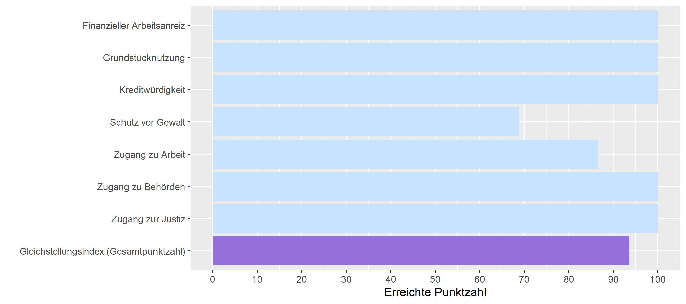

```{r setup, include=FALSE}
knitr::opts_chunk$set(echo = FALSE)

library(usethis)
library(dplyr)
library(tidyverse)
library(ggplot2)
library(scales)
library("openxlsx")

bechdel <- readr::read_csv('https://raw.githubusercontent.com/rfordatascience/tidytuesday/master/data/2021/2021-03-09/movies.csv')
# Trennung bei Länder-Kombinationen und Entfernung NAs
bechdel %>%
  separate_rows(country, sep = ", ") %>%
  group_by(country) %>%
  drop_na(country) -> bechdel2

equality <- read.xlsx(xlsxFile = "data/Equality_Index.xlsx", 
                      sheet = 2)
```

# Ergebnisse beim Gleichstellungsindex
```{r}
equality_long <- equality %>%
  filter(Economy == "New Zealand") %>%
  select(ends_with("score"))

# Umbenennung der Skalen
names(equality_long) <- c("Gleichstellungsindex (Gesamtpunktzahl)", "Zugang zu Behörden", "Grundstücknutzung", "Zugang zur Justiz", "Finanzieller Arbeitsanreiz", "Kreditwürdigkeit", "Zugang zu Arbeit", "Schutz vor Gewalt")
  
pivot_longer(equality_long,
            cols = everything(),
            names_to = "name", values_to = "score") -> equality_long
equality_long %>% mutate(ToHighlight = ifelse(name == "Gleichstellungsindex (Gesamtpunktzahl)", "ja", "nein")) -> equality_long

library(forcats)

p <-  equality_long %>%
  ggplot() +
    aes(y = fct_relevel(name, "Gleichstellungsindex (Gesamtpunktzahl)", 
                        "Zugang zur Justiz", "Zugang zu Behörden", 
                        "Zugang zu Arbeit", "Schutz vor Gewalt", 
                        "Kreditwürdigkeit", "Grundstücknutzung", 
                        "Finanzieller Arbeitsanreiz"), 
        x = score, 
        xmin = 0, xmax = 100,
        fill = ToHighlight) +
    geom_col() +
    labs(x = "Erreichte Punktzahl", y = "") +
    scale_x_continuous(breaks = c(0, 10, 20, 30, 40, 50, 60, 70, 80, 90, 100)) +
    scale_fill_manual(values = c("ja" = "#9370db", "nein" = "slategray1"), guide = FALSE)

ggsave("images/New Zealand_equality.png", plot = p, height = 4, width = 9)
```


## Hindernisse 

### Finanzieller Arbeitsanreiz {.panel-name}

Nach dem Gleichstellungsindex vom CFR hat Neuseeland keine Hindernisse in diesem Bereich.

### Grundstücknutzung {.panel-name}

Nach dem Gleichstellungsindex vom CFR hat Neuseeland keine Hindernisse in diesem Bereich.

### Kreditwürdigkeit {.panel-name}

Nach dem Gleichstellungsindex vom CFR hat Neuseeland keine Hindernisse in diesem Bereich.

### Schutz vor Gewalt {.panel-name}


### Zugang zu Arbeit {.panel-name}


### Zugang zu Behörden {.panel-name}

Nach dem Gleichstellungsindex vom CFR hat Neuseeland keine Hindernisse in diesem Bereich.

### Zugang zur Justiz {.panel-name}

Nach dem Gleichstellungsindex vom CFR hat Neuseeland keine Hindernisse in diesem Bereich.

### Gleichstellungsindex (Gesamtpunktzahl) {.panel-name}


# Ergebnisse beim Bechdel-Test
# Allgemeine Situation der Gleichstellung
# Vergleich
# Fazit
